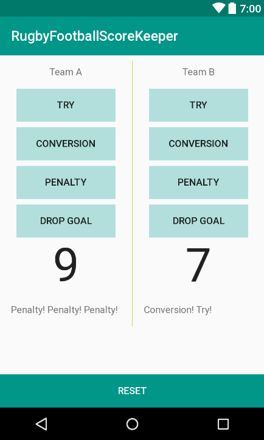

# Rugby Football Score Keeper

Fourth task from Udacity's [Android basics course](https://www.udacity.com/course/android-basics-nanodegree-by-google--nd803)

Android Basics: User Input

Lesson 4: Score Keeper App

Screen is split to two columns and at the bottom there is a reset button.

First column belongs to team A and second to team B.

Each team got points' display, points' history display, and four buttons:
- Try
- Conversion
- Penalty
- Drop Goal

When you click each button, it's displayed in points' history stack and points are added in the corresponding column.
- Try => 5
- Conversion => 2
- Penalty => 3
- Drop Goal => 3

When you click reset button points are at zero again and there is no points' history beneath them.

App doesn't save any information when you close it.

Points' history stack is unscrollable.
